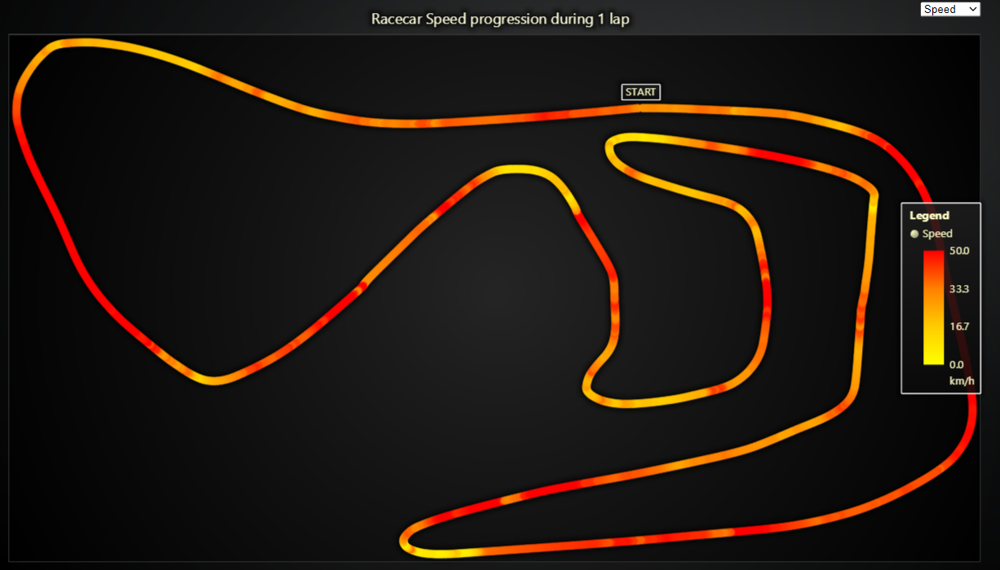

# JavaScript Racecar Track Data Analysis Chart

This demo application belongs to the set of examples for LightningChart JS, data visualization library for JavaScript.

LightningChart JS is entirely GPU accelerated and performance optimized charting library for presenting massive amounts of data. It offers an easy way of creating sophisticated and interactive charts and adding them to your website or web application.

The demo can be used as an example or a seed project. Local execution requires the following steps:

-   Make sure that relevant version of [Node.js](https://nodejs.org/en/download/) is installed
-   Open the project folder in a terminal:

          npm install              # fetches dependencies
          npm start                # builds an application and starts the development server

-   The application is available at _http://localhost:8080_ in your browser, webpack-dev-server provides hot reload functionality.

## Description

Example that showcases `LineSeries` feature for coloring line dynamically based on separate Value data set.

This example takes place in the field of motor-sports, more specifically the analysis of data gathered from a remote controlled racecar while driving on a race track.

**Both the data as well as use case in this example originates from a real user of LightningChart JS** - TestLogger produces a complete data management and analytics system for RC cars and is one of our satisfied long-time partners. You can read more how they are able to take advantage of LightningChart JS in their craft at our [case study](https://lightningchart.com/news/data-analytics-for-racing-testlogger-case-study-lightningchart/).

The TestLogger software gathers an immense amount of high precision data from the RC car in real-time - for example in this application, speed, steering and throttle information are visualized. Each measurement is paired with a location information, which tells where the RC car was located at the time of measurement.

Something that we found amazing was that the RC car location information is actually calculated in real-time by tracking the orientation and speed of the RC car itself - it is not relying on GPS or any other positioning system!

In this example, the RC car data is used to dynamically color the path of the RC car based on the selected data set. For example, when "Speed" is analyzed, low speeds are colored as white and high speeds are colored as red.

By looking at the produced visualization, bottlenecks in the race can be spotted easily even with the naked eye.

Dynamic line coloring is a powerful feature which can serve many different needs. The best thing about it is that it doesn't compromise performance, meaning that you can use it just as well with 100 data points or 100 million data points.

In addition to dynamic coloring by separate Value data set there are also more dynamic coloring modes available:

-   [Line dynamic coloring by X coordinates](https://lightningchart.com/lightningchart-js-interactive-examples/examples/lcjs-example-0050-linePaletteX.html)
-   [Line dynamic coloring by Y coordinates](https://lightningchart.com/lightningchart-js-interactive-examples/examples/lcjs-example-0051-linePaletteY.html)

## API Links

* [Chart XY]
* [Axis]
* [Line series]
* [Paletted fill]
* [Color lookup table]
* [Color RGBA]
* [Empty line style]
* [Axis tick strategies]
* [UI element builders]
* [UI element origins]
* [UI text box]

## Support

If you notice an error in the example code, please open an issue on [GitHub][0] repository of the entire example.

Official [API documentation][1] can be found on [LightningChart][2] website.

If the docs and other materials do not solve your problem as well as implementation help is needed, ask on [StackOverflow][3] (tagged lightningchart).

If you think you found a bug in the LightningChart JavaScript library, please contact support@lightningchart.com.

Direct developer email support can be purchased through a [Support Plan][4] or by contacting sales@lightningchart.com.

[0]: https://github.com/Arction/
[1]: https://lightningchart.com/lightningchart-js-api-documentation/
[2]: https://lightningchart.com
[3]: https://stackoverflow.com/questions/tagged/lightningchart
[4]: https://lightningchart.com/support-services/

© LightningChart Ltd 2009-2022. All rights reserved.

[Chart XY]: https://lightningchart.com/lightningchart-js-api-documentation/v4.1.0/classes/ChartXY.html
[Axis]: https://lightningchart.com/lightningchart-js-api-documentation/v4.1.0/classes/Axis.html
[Line series]: https://lightningchart.com/lightningchart-js-api-documentation/v4.1.0/classes/LineSeries.html
[Paletted fill]: https://lightningchart.com/lightningchart-js-api-documentation/v4.1.0/classes/PalettedFill.html
[Color lookup table]: https://lightningchart.com/lightningchart-js-api-documentation/v4.1.0/classes/LUT.html
[Color RGBA]: https://lightningchart.com/lightningchart-js-api-documentation/v4.1.0/functions/ColorRGBA.html
[Empty line style]: https://lightningchart.com/lightningchart-js-api-documentation/v4.1.0/variables/emptyLine.html
[Axis tick strategies]: https://lightningchart.com/lightningchart-js-api-documentation/v4.1.0/variables/AxisTickStrategies.html
[UI element builders]: https://lightningchart.com/lightningchart-js-api-documentation/v4.1.0/variables/UIElementBuilders.html
[UI element origins]: https://lightningchart.com/lightningchart-js-api-documentation/v4.1.0/variables/UIOrigins.html
[UI text box]: https://lightningchart.com/lightningchart-js-api-documentation/v4.1.0/interfaces/UITextBox.html

